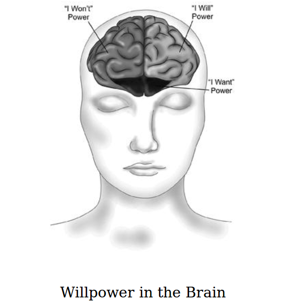
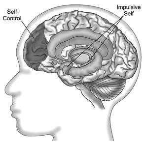

## The Willpower Instinct

- **How self-control works?**
- **Why it matters?**
- **What you can do to get more of it?**

*The intelligent want self-control; children want candy. —RUMI*

### INTRODUCTION -  Welcome to Willpower
What willpower?
- Willpower—the ability to control their attention, emotions, and desires—influences their physical health, financial security, relationships, and professional success.

Status:
- Most people feel like willpower failures—in control one moment but overwhelmed and out of control the next.
- Even the best-controlled feel a kind of exhaustion at keeping it all together and wonder if life is supposed to be such a struggle

It's a course
- “The Science of Willpower,” a class offered to the public through Stanford University’s Continuing Studies program
- The course brings together the newest insights about self-control from **psychology**, **economics**,** neuroscience**, and **medicine** to explain **how** we can break old habits and create healthy habits, conquer procrastination, find our focus, and manage stress. It illuminates **why** we give in to temptation and **how** we can find the strength to resist. It demonstrates the importance of understanding the limits of self-control, and presents the best strategies for training willpower.
- The consensus of the students was clear: Understanding the science of willpower gave them strategies for developing self-control, and greater strength to pursue what mattered most to them.
- combines the best scientific insights and practical exercises from the course, using the latest research and the acquired wisdom of the hundreds of students who have taken the class.

#### TO SUCCEED AT SELF - CONTROL , YOU NEED TO KNOW HOW YOU FAIL
- the best way to improve your self-control is to see how and why you lose control.
- people who think they have the most willpower are actually the most likely to lose control when tempted.
- Self-knowledge—especially of how we find ourselves in willpower trouble—is the foundation of self-control.
- this book focus on the most common willpower mistakes we all make.
- dispels a common misconception about self-control and gives you a new way to think about your willpower challenges. For every willpower mistake, we’ll conduct a kind of autopsy: When we give in to temptation or put off what we know we should do, what leads to our downfall? What is the fatal error, and why do we make it? Most important, we will look for the opportunity to save our future selves from this fate. How can we turn the knowledge of how we fail into strategies for success?
- science of willpower makes clear is that everyone struggles in some way with temptation, addiction, distraction, and procrastination.These are not individual weaknesses that reveal our personal inadequacies—they are universal experiences and part of the human condition.

#### HOW TO USE THIS BOOK
#####BECOME A WILLPOWER SCIENTIST
treat this book like an experiment.
- “Under the Microscope.”
	- how an idea is already operating in your life
	- Before you can change something, you need to see it as it is.
	- just like a scientist peering into a microscope, hoping to discover something fascinating and useful.
- “Willpower Experiments”
	- practical strategies for improving self-control based on a scientific study or theory.
	- have an open mind about each strategy, even the ones that seem counterintuitive

##### YOUR WILLPOWER CHALLENGE
picking a specific willpower challenge to test every idea against.
- “I will”:something you’ve been avoiding
- “I won’t”:a habit you want to break
- "I want":an important goal in your life that you’d like to give more energy and focus to

##### TAKE YOUR TIME
- ten chapters, each of which describes one key idea, the science behind it, and how it can be applied to your goals.
- pace yourself when it comes to implementing the strategies.
- take an entire week to observe how each idea plays out in their own lives.try one new strategy for self-control each week, and report on what worked best.
- Give yourself time to try out the practical exercises and reflect. Pick one strategy from each chapter—whichever seems most relevant to your challenge—rather than trying out ten new strategies at once.

##### LET’S BEGIN
Choose one challenge for our journey through the science of willpower.
- [ ] Reading at home and on bus

#### UNDER THE MICROSCOPE: CHOOSE YOUR WILLPOWER CHALLENGE
- “I will” power challenge: What is something that you would like to do more of, or stop putting off, because you know that doing it will improve the quality of your life?
	- [ ] Reading at home and on bus
	- [ ] Thinking
	- [ ] Practise English
	- [ ] Start Wechat public number and write articles
	- [ ] Painting
	- [ ] Learn things about Economics
- “I won’t” power challenge: What is the “stickiest” habit in your life? What would you like to give up or do less of because it’s undermining your health, happiness, or success?
	- [ ] Angry or pretend to be angry about little things
	- [ ] Used to strike my husband, not encourage him
- “I want” power challenge: What is the most important long-term goal you’d like to focus your energy on? What immediate “want” is most likely to distract you or tempt you away from this goal?
	- [ ] 

***
### ONE - I Will, I Won’t, I Want: What Willpower Is, and Why It Matters
- Willpower is about harnessing the three powers of I will, I won’t, and I want to help you achieve your goals (and stay out of trouble)
- take a quick peek into the brain to see where the magic happens, and discover how we can train the brain to have more willpower.
- take our first look at why willpower can be hard to find, and how to use another uniquely human trait—self-awareness—to avoid willpower failure.

#### WHY WE HAVE WILLPOWER
- We have to have willpower since being homo sapiens. We need self-control to be good for ourselves and our tribe.
- we have willpower: the ability to control the impulses that helped us become fully human.

#### WHY IT MATTERS NOW
Willpower has gone from being the thing that distinguishes us humans from other animals to the thing that distinguishes us from each other.

#### THE NEUROSCIENCE OF I WILL, I WON’T, AND I WANT
the development of the prefrontal cortex
- controlled physical movement
- controlling what you pay attention to, what you think about, even how you feel. controlling what you do.
- bias the brain—and therefore, you—toward doing “the harder thing.”
- Willpower in the brain

##### UNDER THE MICROSCOPE: WHAT IS THE HARDER THING?
Every willpower challenge requires doing something difficult, whether it’s walking away from temptation or not running away from a stressful situation. Imagine yourself facing your specific willpower challenge. What is the harder thing? What makes it so difficult? How do you feel when you think about doing it?
+ What is the harder thing?
	- [ ]
	- [ ]
+ What makes it so difficult?
	- [ ]
	- [ ]
+ How do you feel when you think about doing it?
	- [ ]
	- [ ]

#### A MIND-BLOWING CASE OF WILLPOWER LOST
The prefrontal cortex is not always as reliable as we’d like. Many temporary states—like being drunk, sleep-deprived, or even just distracted—inhibit the prefrontal cortex, mimicking the brain damage that Gage sustained. This leaves us less able to control our impulses, even though our gray matter is still safe in our skulls. Even when our brains are well rested and sober, we aren’t fully out of danger. That’s because while we all have the capacity to do the harder thing, we also have the desire to do exactly the opposite. This impulse needs to be restrained, and as we’ll see, it often has a mind of its own.

#### THE PROBLEM OF TWO MINDS
T- hat means that for any instinct that once served us well, evolution has kept it around—even if it now gets us into trouble. The good news is, evolution has also given us a way to handle the problems we run into.
- we’re stuck with the impulse, we’re also equipped with the impulse control.
- we have one brain but two minds—or even, two people living inside our mind. There’s the version of us that acts on impulse and seeks immediate gratification, and the version of us that controls our impulses and delays gratification to protect our long-term goals.
- The part of you that wants to give in isn’t bad—it simply has a different point of view about what matters most.

##### UNDER THE MICROSCOPE: MEET YOUR TWO MINDS
    Every willpower challenge is a conflict between two parts of oneself. For your own willpower challenge, describe these competing minds. What does the impulsive version of you want? What does the wiser version of you want? Some people find it useful to give a name to the impulsive mind, like “the cookie monster” to the part of you that always wants instant gratification, “the critic” to the part of you that likes to complain about everyone and everything, or “the procrastinator” to the person who never wants to get started. Giving a name to this version of yourself can help you recognize when it is taking over, and also help you call in your wiser self for some willpower support.
+ What does the impulsive version of you want?
	- [ ]
+ What does the wiser version of you want?
	- [ ]
+ Giving names to vertions of you
	- [x]
	- [ ]

#### THE VALUE OF BOTH SELVES
- it is a mistake to think we should conquer the primitive self completely.
- without desires we’d become depressed, and without fear we’d fail to protect ourselves from future danger.
- the self-control system and our survival instincts don’t always conflict. In some cases, they cooperate to help us make good decisions.
- As we aim to improve our willpower, we’ll look for ways to use every bit of what it means to be human—including our most primitive instincts, from the desire for pleasure to the need to fit in—to support our goals.

#### THE FIRST RULE OF WILLPOWER: KNOW THYSELF
- self-awareness: the ability to realize what we are doing as we do it, and understand why we are doing it.
- Without self-awareness, the self-control system would be useless. You need to recognize when you’re making a choice that requires willpower; otherwise, the brain always defaults to what is easiest.
- most of our choices are made on autopilot, without any real awareness of what’s driving hem, and certainly without serious reflection on their consequences. Heck, most of the time, we don’t even realize we’re making a choice.
- How can you control yourself if you aren’t even aware that there is something to control?
- people who are distracted are more likely to give in to temptations.
- When your mind is preoccupied, your impulses—not your long-term goals—will guide your choices.

##### WILLPOWER EXPERIMENT:TRACK YOUR WILLPOWER CHOICES
To have more self-control, you first need to develop more self-awareness. A good first step is to notice when you are making choices related to your willpower challenge. Some will be more obvious, such as, “Do I go to the gym after work?” The impact of other decisions might not be clear until later in the day, when you see their full consequences. For example, did you choose to pack your gym bag so you wouldn’t have to go home first? (Smart! You’ll be less likely to make excuses.) Did you get caught up in a phone call until you were too hungry to go straight to the gym? (Oops! You’ll be less likely to exercise if you have to stop for dinner first.) For at least one day, track your choices. At the end of the day, look back and try to analyze when decisions were made that either supported or undermined your goals. Trying to keep track of your choices will also reduce the number of decisions you make while distracted—a guaranteed way to boost your willpower.
- My self-awareness
    - [ ] read on bus but sometime watch outside and sometimes want to sleep
    - [ ]

#### AN E-MAIL ADDICT TAKES THE FIRST STEP TO RECOVERY
- With this awareness of both the impulse and her response, she had much more control over her behavior, and even surpassed her original goal to check less often outside of work hours.
- This week, commit to watching how the process of giving in to your impulses happens. You don’t even need to set a goal to improve your self-control yet. See if you can catch yourself earlier and earlier in the process, noticing what thoughts, feelings, and situations are most likely to prompt the impulse. What do you think or say to yourself that makes it more likely that you will give in?
	- [ ]
	- [ ]

#### TRAIN YOUR BRAIN FOR WILLPOWER
- the brain is remarkably responsive to experience.
- remodels itself based on what you ask it to do.
- train your brain to get better at self-control.
	- challenge your “I won’t” power
	- build your own “I will” power obstacle course
	- meditate.

##### WILLPOWER EXPERIMENT:A FIVE-MINUTE BRAIN-TRAINING MEDITATION
+ Breath focus is a simple but powerful meditation technique for training your brain and increasing willpower. It reduces stress and teaches the mind how to handle both inner distractions (cravings, worries, desires) and outer temptations (sounds, sights, and smells). Whatever your “I will” and “I won’t” challenges are, this five-minute meditation is a powerful brain-training exercise for boosting your willpower.
	- Sit still and stay put .
	- Turn your attention to the breath.
	-  Notice how it feels to breathe, and notice how the mind wanders.
-  Start with five minutes a day. When this becomes a habit, try ten to fifteen minutes a day. If that starts to feel like a burden, bring it back down to five. A short practice that you do every day is better than a long practice you keep putting off to tomorrow. 

#### BEING BAD AT MEDITATION IS GOOD FOR SELF-CONTROL
- catch himself moving away from a goal and then point himself back at the goal (in this case, focusing on the breath).
- self-control was a process of noticing that he was off-goal and redirecting himself to the goal. 
- Meditation is not about getting rid of all your thoughts; it’s learning not to get so lost in them that you forget what your goal is. Don’t worry if your focus isn’t perfect when meditating. Just practice coming back to the breath, again and again.

#### THE LAST WORD
we each have multiple selves that compete for control of our thoughts, feelings, and actions. Every willpower challenge is a battle among these different versions of ourselves. To put the higher self in charge, we need to strengthen the systems of self-awareness and self-control. When we do, we will find the willpower and the want power to do the harder thing.

##### CHAPTER SUMMARY
- The Idea: Willpower is actually three powers—I will, I won’t, and I want—that help us to be a better version of ourselves.
- Under the Microscope
	- [ ] What is the harder thing? Imagine yourself facing your willpower challenge, and doing the harder thing. What makes it hard?
	- [ ] Meet your two minds. For your willpower challenge, describe your two competing selves. What does the impulsive version of you want? What does the wiser version of you want?
- Willpower Experiments
	- [ ] Track your willpower choices. For at least one day, try to notice every decision you make related to your willpower challenge.
	- [ ] Five-minute brain-training meditation. Focus on your breath using the words “inhale” and “exhale” in your mind. When your mind wanders, notice, and bring it back to the breath.
	
***
### TWO - The Willpower Instinct: Your Body Was Born to Resist Cheesecake
- self-control is a matter of physiology, not just psychology. It’s a temporary state of both mind and body that gives you the strength and calm to override your impulses.

#### A TALE OF TWO THREATS

##### WHEN DANGER STRIKES
- fight-or-flight stress response.the built-in ability of your body and brain to devote all of their energy to saving your butt in an emergency.

##### A NEW KIND OF THREAT
- self-preservation

##### UNDER THE MICROSCOPE : WHAT IS THE THREAT?
- For your willpower challenge, identify the inner impulse that needs to be restrained. 
	- [ ] What is the thought or feeling that makes you want to do whatever it is you don’t want to do? If you aren’t sure, try some field observation. Next time you’re tempted, turn your attention inward.

#### THE WILLPOWER INSTINCT: PAUSE AND PLAN
- fight-or-flight stress response starts when you recognize an external threat.
- pause-and-plan starts with the perception of an internal conflict
- The perception of an internal conflict triggers changes in the brain and body that help you slow down and control your impulses.

##### THIS IS YOUR BRAIN AND BODY ON WILLPOWER

##### THE BODY’S WILLPOWER “RESERVE”
- Heart rate variability
- goes up : willpower. better at ignoring distractions, delaying gratification, and dealing with stressful situations
- drops : less willpower

##### WILLPOWER EXPERIMENT: BREATHE YOUR WAY TO SELF-CONTROL
- slowing down your breath
- a daily twenty-minute practice of slowed breathing increased heart rate variability and reduced cravings and depression

##### WILLPOWER RX
Slowing down the breath gave them a sense of control over their mind and body, and helped them find the courage they needed in difficult situations.

#### TRAIN YOUR MIND AND YOUR BODY
- energy from the body to the brain.
- your prefrontal cortex will communicate the need for self-control to lower brain regions that regulate your heart rate, blood pressure, breathing, and other automatic functions.

##### THE WILL POWER MIRACLE
- The willpower miracle was physical exercise.
- When neuroscientists have peered inside the brains of new exercisers, they have seen increases in both gray matter—brain cells—and white matter, the insulation on brain cells that helps them communicate quickly and efficiently with each other. Physical exercise—like meditation—makes your brain bigger and faster, and the prefrontal cortex shows the largest training effect.

##### WILLPOWER EXPERIMENT: THE FIVE-MINUTE GREEN WILLPOWER FILL-UP
+ If you want a quick willpower fill-up, your best bet may be to head outdoors. Just five minutes of what scientists call “green exercise” decreases stress, improves mood, enhances focus, and boosts self-control. Green exercise is any physical activity that gets you outdoors and in the presence of Mama Nature. The best news is that when it comes to green exercise, a quick fix really is enough. Shorter bursts have a more powerful effect on your mood than longer workouts. You also don’t have to break a sweat or push yourself to exhaustion. Lower-intensity exercise, like walking, has stronger immediate effects than high-intensity exercise. Here are some ideas for your own five-minute green exercise willpower fill-up:
    - Get out of the office and head for the closest greenery.
    - Cue up a favorite song on your iPod and walk or jog around the block.
    - Take your dog outside to play (and chase the toy yourself).
    - Do a bit of work in your yard or garden.
    - Step outside for some fresh air and do a few simple stretches.
    - Challenge your kids to a race or game in the backyard.

##### A RELUCTANT EXERCISER CHANGES HIS MIND
- If you tell yourself that you are too tired or don’t have the time to exercise, start thinking of exercise as something that restores, not drains, your energy and willpower.

##### GAIN WILLPOWER IN YOUR SLEEP!
- Why does poor sleep sap willpower? For starters, sleep deprivation impairs how the body and brain use glucose, their main form of energy. When you’re tired, your cells have trouble absorbing glucose from the bloodstream.
- When your prefrontal cortex is impaired, it loses control over other regions of the brain.

##### WILLPOWER EXPERIMENT: ZZZZZZZZZZ
- If you’ve been running short on sleep, there are many ways to recharge your self-control. Even if you can’t get eight hours of uninterrupted sleep every night, small changes can make a big difference. Some studies show that a single good night’s sleep restores brain function to an optimal level. So if you’ve had a week of late to bed and early to rise, catching up on the weekend can help replenish your willpower. Other research suggests that getting enough sleep early in the week can build a reserve that counteracts sleep deprivation later in the week. And some studies suggest that it’s the number of consecutive hours you spend awake that matters most. In a crunch, taking a short nap can restore focus and self-control even if you didn’t get much sleep the night before. Try one of these strategies—catching up, stocking up, or napping—to undo or prevent the effects of sleep deprivation.

#### WHEN SLEEP IS THE WILLPOWER CHALLENGE
- If you know you could use more sleep but you find yourself staying up late anyway, consider what you are saying “yes” to instead of sleep. This same willpower rule applies to any task you are avoiding or putting off—when you can’t find the will, you might need to find the won’t.

#### THE COSTS OF TOO MUCH SELF-CONTROL
- self-control also demands high levels of energy, some scientists speculate that chronic self-control—like chronic stress—can increase your chances of getting sick by diverting resources from the immune system. 

##### WILLPOWER EXPERIMENT: RELAX TO RESTORE YOUR WILLPOWER RESERVE
- The kind of relaxation that boosts willpower is true physical and mental rest that triggers what Harvard Medical School cardiologist Herbert Benson calls the physiological relaxation response. Your heart rate and breathing slow down, your blood pressure drops, and your muscles release held tension. Your brain takes a break from planning the future or analyzing the past.
- To trigger this relaxation response, lie down on your back, and slightly elevate your legs with a pillow under the knees (or come into whatever is the most comfortable position for you to rest in). Close your eyes and take a few deep breaths, allowing your belly to rise and fall. If you feel any tension in your body, you can intentionally squeeze or contract that muscle, then let go of the effort.
- there is nothing to do but breathe. If you’re worried about falling asleep, set an alarm.

#### ONE NATION UNDER STRESS
- Stress is the enemy of willpower.Stress encourages you to focus on immediate, short-term goals and outcomes, but self-control requires keeping the big picture in mind. Learning how to better manage your stress is one of the most important things you can do to improve your willpower.

##### UNDER THE MICROSCOPE: STRESS AND SELF-CONTROL
This week, test the theory that stress—whether physical or psychological—is the enemy of self-control.

- How does being worried or overworked affect your choices?
- Does being hungry or tired drain your willpower?
- What about physical pain and illness? Or emotions like anger, loneliness, or sadness?
Notice when stress strikes throughout the day or week. Then watch what happens to your self-control.

- Do you experience cravings? Lose your temper? Put off things you know you should do?

#### THE LAST WORD
When our willpower challenges overwhelm us, it’s tempting to assign the blame to who we are: weak, lazy, willpowerless wimps. But more often than not, our brains and bodies are simply in the wrong state for self-control. When we’re in a state of chronic stress, it’s our most impulsive selves who face our willpower challenges. To succeed at our willpower challenges, we need to find the state of mind and body that puts our energy toward self-control, not self-defense. That means giving ourselves what we need to recover from stress, and making sure we have the energy to be our best selves.

##### CHAPTER SUMMARY
The Idea: Willpower is a biological instinct, like stress, that evolved to help us protect ourselves from ourselves.
Under the Microscope.

- What is the threat? For your willpower challenge, identify the inner impulse that needs to be restrained.
- Stress and self-control. Notice when stress strikes throughout the day or week, and watch what happens to your self-control. Do you experience cravings? Lose your temper? Put off things you know you should do?

##### Willpower Experiments
- Breathe your way to self-control. Slow down your breathing to four to six breaths per minute to shift into the physiological state of self-control.
- The five-minute green willpower fill-up. Get active outdoors—even just a walk around the block—to reduce stress, improve your mood, and boost motivation.
- Zzzzzzzzzz. Undo the effects of sleep deprivation with a nap or one good night’s sleep.
- Relax to restore your willpower reserve. Lie down, breathe deeply, and let the physiological relaxation response help you recover from the demands of self-control and daily stress.
***
### THREE - Too Tired to Resist: Why Self-Control Is Like a Muscle
only so much willpower to go around. Once exhausted, you are left defenseless against temptation—or at least disadvantaged.
self-control is highest in the morning and steadily deteriorates over the course of the day.

#### THE MUSCLE MODEL OF SELF-CONTROL
every act of willpower was drawing from the same source of strength, leaving people weaker with each successful act of self-control.
every act of willpower depletes willpower, using self-control can lead to losing control

##### UNDER THE MICROSCOPE: THE HIGHS AND LOWS OF WILLPOWER
The muscle model of willpower predicts that self-control drains throughout the day. This week, pay attention to when you have the most willpower, and when you are most likely to give in. Do you wake up with willpower and steadily drain it? Or is there another time of the day when you find yourself recharged and refreshed? You can use this self-knowledge to plan your schedule wisely, and limit temptations when you know you’ll be the most depleted.

#### A WOULD-BE ENTREPRENEUR PUTS FIRST THINGS FIRST
It also demonstrates an important willpower rule: If you never seem to have the time and energy for your “I will” challenge, schedule it for when you have the most strength.

#### WHY IS SELF-CONTROL LIMITED?
that with each use of willpower, the self-control system of the brain becomes less active.
Could willpower exhaustion simply be the result of the brain running out of energy?
boosting blood sugar restored willpower. The participants who drank sugar-sweetened lemonade showed improved self-control, while the self-control of those who drank the placebo lemonade continued to deteriorate.
How much energy, exactly, was getting used up during acts of mental self-control? And did restoring that energy really require consuming a substantial amount of sugar? 

#### ENERGY CRISIS
When the brain detects a drop in available energy, it gets a little nervous. What if it runs out of energy? Like the banks, it may decide to stop spending and save what resources it has. It will keep itself on a tight energy budget, unwilling to spend its full supply of energy. The first expense to be cut? Self-control, one of the most energy-expensive tasks the brain performs. To conserve energy, the brain may become reluctant to give you the full mental resources you need to resist temptation, focus your attention, or control your emotions.
“energy budget” model of self-control. They argue that the brain treats energy like money. It will spend energy when resources are high, but save energy when resources are dropping. 
The brain asked, “Is available energy increasing or decreasing?” It then made a strategic choice about whether to spend or save that energy.

#### PEOPLE WHO ARE STARVING SHOULDN’T SAY NO TO A SNACK
when your blood sugar drops, your brain will still favor short-term thinking and impulsive behavior. Your brain’s priority is going to be getting more energy, not making sure you make good decisions that are in line with your long-term goals. That means stockbrokers may make some stupid buys before lunch, dieters may be more likely to “invest” in lottery tickets, and the politician who skips breakfast may find his intern irresistible.

##### WILLPOWER EXPERIMENT: THE WILLPOWER DIET
Yes, it’s true that a shot of sugar can give you a short-term willpower boost in an emergency. In the long run, though, mainlining sugar is not a good strategy for self-control. During stressful times, it’s especially tempting to turn to highly processed, high-fat, and high-sugar “comfort” food. Doing so, however, will lead to a self-control crash and burn. In the long term, blood sugar spikes and crashes can interfere with the body’s and brain’s ability to use sugar—meaning that you could end up with high blood sugar, but low energy (as is the case for the millions of Americans with type 2 diabetes9). A better plan is to make sure that your body is well-fueled with food that gives you lasting energy. Most psychologists and nutritionists recommend a low-glycemic diet—that is, one that helps you keep your blood sugar steady. Low-glycemic foods include lean proteins, nuts and beans, high-fiber grains and cereals, and most fruits and vegetables—basically, food that looks like its natural state and doesn’t have a ton of added sugar, fat, and chemicals. It may take some self-control to shift in this direction, but whatever steps you take (say, eating a hearty and healthy breakfast during the workweek instead of skipping breakfast, or snacking on nuts instead of sugar) will more than pay you back for any willpower you spend making the change.

#### TRAINING THE WILLPOWER MUSCLE
Challenge the self-control muscle by asking people to control one small thing that they aren’t used to controlling.
It’s the habit of noticing what you are about to do, and choosing to do the more difficult thing instead of the easiest. Through each of these willpower exercises, the brain gets used to pausing before acting. The triviality of the assignments may even help this process. The tasks are challenging, but they’re not overwhelming. And while the self-restraints require careful attention, they’re unlikely to trigger strong feelings of deprivation.

#### WILLPOWER EXPERIMENT: A WILLPOWER WORKOUT
If you want to put yourself through your own willpower-training regime, test the muscle model of self-control with one of the following willpower workouts:

- Strengthen “I Won’t” Power: Commit to not swearing (or refraining from any habit of speech), not crossing your legs when you sit, or using your nondominant hand for a daily task like eating or opening doors.
- Strengthen “I Will” Power: Commit to doing something every day (not something you already do) just for the practice of building a habit and not making excuses. It could be calling your mother, meditating for five minutes, or finding one thing in your house that needs to be thrown out or recycled.
- Strengthen Self-Monitoring: Formally keep track of something you don’t usually pay close attention to. This could be your spending, what you eat, or how much time you spend online or watching TV. You don’t need fancy technology—pencil and paper will do. But if you need some inspiration, the Quantified Self movement (www.quantifiedself.com) has turned self-tracking into an art and science.

#### A CANDYADDICT CONQUERS HIS SWEET TOOTH
When you’re trying to make a big change or transform an old habit, look for a small way to practice self-control that strengthens your willpower, but doesn’t overwhelm it completely.

#### HOW REAL ARE THE “LIMITS” OF SELF-CONTROL?

#### MAKING THE FINISHLINE

Just as the brain may tell the body’s muscles to slow down when it fears physical exhaustion, the brain may put the brakes on its own energy-expensive exercise of the prefrontal cortex. This doesn’t mean we’re out of willpower; we just need to muster up the motivation to use it.

##### UNDER THE MICROSCOPE: IS YOUR EXHAUSTION REAL?
All too often, we use the first feeling of fatigue as a reason to skip exercise, snap at our spouses, procrastinate a little longer, or order a pizza instead of cooking a healthy meal. To be sure, the demands of life really do drain our willpower, and perfect self-control is a fool’s quest. But you may have more willpower than the first impulse to give in would suggest. The next time you find yourself “too tired” to exert self-control, challenge yourself to go beyond that first feeling of fatigue. (Keep in mind that it’s also possible to overtrain—and if you find yourself constantly feeling drained, you may need to consider whether you have been running yourself to real exhaustion.)

#### WHEN THERE’S A WANT, THERE’S A WILL
While this is a less obvious motivator, it’s one that plays a big role in determining whether or not people stick with difficult changes in real life.

##### WILLPOWER EXPERIMENT: WHAT’S YOUR “WANT” POWER?
When your willpower is running low, find renewed strength by tapping into your want power. For your biggest willpower challenge, consider the following motivations:

1. How will you benefit from succeeding at this challenge? What is the payoff for you personally? Greater health, happiness, freedom, financial security, or success?
2. Who else will benefit if you succeed at this challenge? Surely there are others who depend on you and are affected by your choices. How does your behavior influence your family, friends, coworkers, employees or employer, and community? How would your success help them?
3. Imagine that this challenge will get easier for you over time if you are willing to do what is difficult now. Can you imagine what your life will be like, and how you will feel about yourself, as you make progress on this challenge? Is some discomfort now worth it if you know it is only a temporary part of your progress?

#### A FRUSTRATED MOM FINDS HER WANT POWER
Sometimes our strongest motivation is not what we think it is, or think it should be. If you’re trying to change a behavior to please someone else or be the right kind of person, see if there is another “want” that holds more power for you.

#### EVERYDAY DISTRACTIONS AND THE COLLAPSE OF A CIVILIZATION
Humans have a natural tendency to focus on immediate gains, and changing course to prevent future disaster takes enormous self-discipline from all members of a society. It’s not just a matter of caring; change requires doing. 
Choice architecture
people who are free to choose anything most often choose against their long-term interests. Research on the limits of self-control suggests that this is not because we are innately irrational, or because we are making deliberate decisions to enjoy today and screw tomorrow. Instead, we may simply be too tired to act against our worst impulses. If we want to strengthen self-control, we may need to think about how we can best support the most exhausted version of ourselves—and not count on an ideal version of ourselves to show up and save the day.

#### THE LAST WORD
The limits of self-control present a paradox: We cannot control everything, and yet the only way to increase our self-control is to stretch our limits. Like a muscle, our willpower follows the rule of “Use it or lose it.” If we try to save our energy by becoming willpower coach potatoes, we will lose the strength we have. But if we try to run a willpower marathon every day, we set ourselves up for total collapse. Our challenge is to train like an intelligent athlete, pushing our limits but also pacing ourselves. And while we can find strength in our motivation when we feel weak, we can also look for ways to help our tired selves make good choices.

##### CHAPTER SUMMARY
The Idea: Self-control is like a muscle. It gets tired from use, but regular exercise makes it stronger.

######Under the Microscope
- The highs and lows of willpower. Keep track of your self-control strength this week, with special interest in when you have the most willpower, and when you are most likely to give in or give up.
- Is your exhaustion real? The next time you find yourself “too tired” to exert self-control, examine whether you can go beyond that first feeling of fatigue to take one more step.

######Willpower Experiments
- The willpower diet. Make sure that your body is well fueled with food that gives you lasting energy.
-  A willpower workout. Exercise your self-control muscle by picking one thing to do (I will power) or not do (I won’t power) this week, or keeping track of something you aren’t used to paying close attention to.
- Find your “want” power. When you find your biggest want power—the motivation that gives you strength when you feel weak—bring it to mind whenever you find yourself most tempted to give in or give up.
***
### FOUR - License to Sin: Why Being Good Gives Us Permission to Be Bad
#### FROM SAINTS TO SINNERS
When it comes to right and wrong, most of us are not striving for moral perfection. We just want to feel good enough—which then gives us permission to do whatever we want.
Whenever we have conflicting desires, being good gives us permission to be a little bit bad.
moral licensing

#### THE WARM AND FUZZY LOGIC OF LICENSING

##### UNDER THE MICROSCOPE: VIRTUE AND VICE
This week, watch how you talk to yourself and others about your willpower failures and successes:

- Do you tell yourself you’ve been “good” when you succeed at a willpower challenge, and “bad” when you give in to procrastination or temptation?
- Do you use your “good” behavior to give yourself permission to do something “bad”? Is this a harmless reward, or is it sabotaging your larger willpower goals?

#### WHEN EXERCISE LICENSES EATING, A BRIDE-TO-BE GAINS WEIGHT
Don’t mistake a goal-supportive action for the goal itself. You aren’t off the hook just because you did one thing consistent with your goal. Notice if giving yourself credit for positive action makes you forget what your actual goal is.

#### THE PROBLEM WITH PROGRESS
goal liberation
“How committed do you feel to your goal?”

##### WILLPOWER EXPERIMENT:TO REVOKE YOUR LICENSE, REMEMBER THE WHY
How do you focus on commitment instead of progress? A study by researchers at Hong Kong University of Science and the University of Chicago provides one strategy. When they asked students to remember a time they turned down a temptation, moral licensing ensued, and 70 percent took the next opportunity to indulge. But when they also asked the participants to remember why they had resisted, the licensing effect disappeared—69 percent resisted temptation. Like magic, the researchers had discovered a simple way to boost self-control and help the students make a choice consistent with their overall goals. Remembering the “why” works because it changes how you feel about the reward of self-indulgence. That so-called treat will start to look more like the threat to your goals that it is, and giving in won’t look so good. Remembering the why will also help you recognize and act on other opportunities to accomplish your goal.
The next time you find yourself using past good behavior to justify indulging, pause and remember the why.

#### WHEN TOMORROW LICENSES TODAY

#### DON’T COUNT YOUR GRILLED CHICKEN SALAD BEFORE IT’S HATCHED
Sometimes the mind gets so excited about the opportunity to act on a goal, it mistakes that opportunity with the satisfaction of having actually accomplished the goal.
We wrongly but persistently expect to make different decisions tomorrow than we do today.
Such optimism licenses us to indulge today—especially if we know we will have the opportunity to choose differently in the near future.
they felt much less guilt over that initial indulgent choice when they thought they could make up for it later.

##### UNDER THE MICROSCOPE: ARE YOU BORROWING CREDIT FROM TOMORROW?
 As you go about making decisions related to your willpower challenge, notice if the promise of future good behavior comes up in your thinking. Do you tell yourself you will make up for today’s behavior tomorrow? What effect does this have on your self-control today? For extra credit, keep paying attention—all the way to tomorrow. Do you actually do what you said you would, or does the cycle of “indulge today, change tomorrow” begin again?

#### WHY THERE’S ALWAYS TIME TO DO IT TOMORROW

***
### FIVE - The Brain’s Big Lie: Why We Mistake Wanting for Happiness
***
### SIX - What the Hell: How Feeling Bad Leads to Giving In
***
### SEVEN - Putting the Future on Sale: The Economics of Instant Gratification
***
### EIGHT - Infected! Why Willpower Is Contagious
***
### NINE - Don’t Read This Chapter: The Limits of “I Won’t” Power
***
### TEN - Final Thoughts
***

- - -
Epigraph
temptation
procrastination
sabotaging
worn-out
consensus
dreaded
assignment
autopsy
dispel
sleuthing
rail against
counterintuitive
flopped
rut
temptress
coach potatoes
exert
harnessing
hyoid
buffalo
hippos
crocodile
knit
loincloth
frolic
aggression
pit against
virtues
charisma
marital
gory
physician
tavern
lingering
indulging
irreverent
deference
restraint
devising
radically
sober
crave
infinitely
vestige
primitive 
elusive
greedy
dawn
poke
podding
deterioration
fidget
succumb
saber
endow
stalk
hominid
scavenging
carcasse
scatter
savannah
antelope
lurk
contemplate
predator
qualm
jaw
clench
amygdala
adrenal gland
respiratory
cardiovascular
inhibited
chicken out
butt
hangnail
detour
predator
delectable
radiant
glisten
chime
dopamine
spike
coma
cranky
conspiracy
palate
enticing
sobriety
regulate
hyperventilation
sedate
paralyze
intact
arrhythmias
sympathetic
revs
parasympathetic
exert
carrot
sober
relapse
rehab
sabotage
resilient
jaw
clench
amygdala
adrenal gland
respiratory
cardiovascular
inhibited
chicken out
sobriety
hyperventilating
sedate
intact
treadmill
busting
RELUCTANT
creep
cholesterol
veal
impairment
brunt
crunch
cranky
tackling
nifty
exertion
grueling
unrelenting
virtue
brute
muster
calibration
sedentary
nagging
pundits
obesity
deficit
tremendous
cram
dorm
flossing
binge
deteriorates
stashed
virtue
satanic
ritual
masochism
abductions
occult
detergent
inadequacies
soothed
obligated
biceps
placebo
lashing
outlast
influx
hoarded
scarcity
abundance
berries
barren
guzzling
vestige
famine
spikes
cereals
mainlining
barbells
regimes
hanger
consistent
angst
energizing
illicit
blisters
hollow
fatigue
metabolize
alkaline
intrigued
cramming
decimate
deterioration
ethically
coaxed
surged
frazzled
CIVILIZATION
timber
acres
chop
lush
cannibalism
noble
prominently
indulgent
innatelyepic
cortices
hysteria
paradoxically
SINNERS
asinine
denounce
hypothetical
hypocrite
vigilant
credentials
indulgence
FUZZY
wardrobe
gut
dubious
mundane
lunacy
ambivalent
patting
aroma
mock
vending
lowbrow
[TOC]
